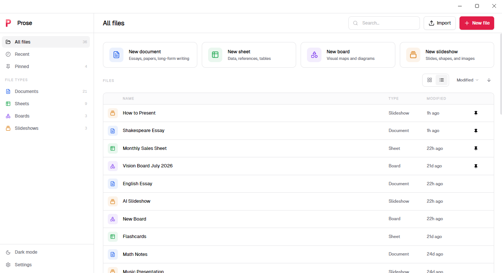
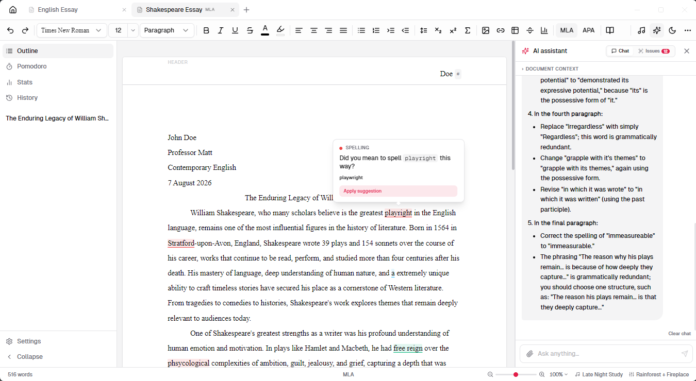

# Prose

A free, fully offline office suite for Windows. Documents, Sheets, Boards, and Slides, with a local AI assistant built into every one of them.

Works on a plane. No account. No subscription. No data leaves your machine.




> **Note on internet use:** Prose is almost entirely offline. The features that need a connection are the one-time Ollama download on first launch, AI model downloads, checking for app updates, DOI lookup for citations, and website metadata auto-fill for citations. Everything else (writing, grammar checking, spreadsheets, whiteboards, presentations, AI feedback, export) works with no connection at all.

## Download

Get the latest installer from the [Releases](https://github.com/websitesbycss/prose/releases) page.

<!-- VIRUSTOTAL: link the scan of the latest Setup .exe here -->

On first launch Prose offers to download [Ollama](https://ollama.com) (~150 MB) automatically, no admin rights required. Then pull any model you like:

```
ollama pull llama3.2
```

The default model is `llama3.2:3b`. You can switch models in Settings > AI. Prose updates itself: when a new version is ready you get a small prompt to restart, and you can check manually in Settings > About.

## The four editors

Prose puts four editors behind one tab bar, so a document, a spreadsheet, a whiteboard, and a slide deck can all be open at once.

### Documents

Rich text editing with headings, lists, tables, images, and LaTeX equations. One-click MLA and APA page setup with proper headers, page numbers, and margins. Citations in MLA, APA, Chicago, and IEEE style with auto-generated in-text citations and a Works Cited or References page. Grammar and style checking runs fully offline through [Harper](https://writewithharper.com), so it is instant, private, and consistent. Document history keeps snapshots you can restore any time. Exports to PDF, DOCX, Markdown, and plain text, with a live paginated preview.

### Sheets

A spreadsheet with formulas, multiple tabs, cell formatting, and merged cells. Charts (bar, line, area, pie, doughnut, scatter, radar) live on the sheet itself and move and zoom with your cells. The AI panel can write or explain formulas, generate tables straight into the grid, and an Insights tab reads your data and suggests formulas and charts with proper titles and axis labels. Exports to XLSX (with working formulas, merges, and column widths) and CSV.

### Boards

An infinite canvas for diagrams, sketches, and freeform notes, built on Excalidraw. Draw freehand, add shapes and sticky notes, embed images. The AI can brainstorm a topic and lay the ideas out as sticky notes for you to rearrange. Exports to PNG or PDF, in light or dark mode.

### Slides

A presentation editor with themes, element animations, slide transitions, speaker notes, and a presenter mode. The Generate tab builds a full deck from a topic, a document, or a spreadsheet: titles, bullets, speaker notes, charts made from your real data, and AI-drawn illustrations placed on the slides that need them. Imports PPTX. Exports to PPTX (editable in PowerPoint, Keynote, or Google Slides), PDF, and PNG.

## AI that stays on your machine

Every model call runs through Ollama on your own hardware. Nothing you write ever leaves your computer. Once a model is downloaded, the assistant works with no internet connection, and you can swap in any model Ollama supports.

The AI is wired into each editor rather than bolted on as a chat box. It rewrites and critiques in Documents, writes formulas and analyzes data in Sheets, brainstorms onto the canvas in Boards, and designs whole decks in Slides.

Also included: focus mode, typewriter mode, a Pomodoro timer, an ambient music and soundscape player, and session stats.

## Development

```bash
git clone https://github.com/websitesbycss/prose.git
cd prose
npm install
npm run dev
```

Build a distributable installer (output lands in `release/`):

```bash
npm run package
```

### Tech stack

| Layer | Library |
|---|---|
| Shell | Electron |
| UI | React 18 + TypeScript |
| Document editor | Tiptap v3 |
| Grammar checking | Harper (WASM, offline) |
| Sheets editor | Fortune-Sheet |
| Boards | Excalidraw |
| Charts | Chart.js |
| Slides import/export | pptxgenjs |
| State | Zustand |
| Database | better-sqlite3 |
| Components | shadcn/ui + Radix UI |
| Animations | Motion (Framer Motion) |
| AI runtime | Ollama (local) |
| DOCX export | docx |
| PDF preview | pdfjs-dist |
| Packaging | electron-builder |

## License

MIT. See [LICENSE](LICENSE).
